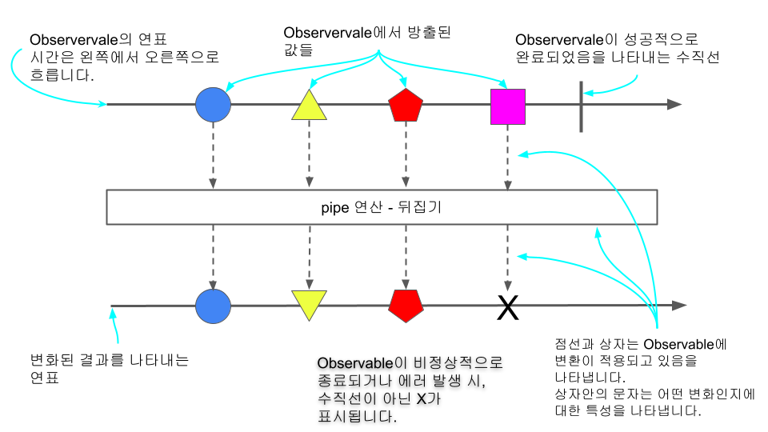

# RXJS

## 목차

|  #  | 목차                                      |
| :-: | :------------------------------------------- |
| 01  | [Observable(스트림생성기)](./Stream/README.md)     |
| 02  | [Observer(구독자)](./Observer/README.md)     |
| 03  | [Operator](./Operator/README.md)     |
| 04  | [실전 예제](./Practice/README.md)     |
---

## 반응형 프로그래밍과 ReactiveX

- ReactiveX는 함수형 프로그래밍의 기본 골격을 갖추고 있습니다.
- ReactiveX는 크게 3 요소로 구성됩니다.
```javascript
const { range } = rxjs;
const { filter, take, map, toArray } = rxjs.operators;

range(1, 20) // Observable -> stream
  .pipe( // pipe
    filter(n => n % 2 === 0), // Operator
    take(5),                  // Operator
    map(n => Math.pow(n, 2)), // Operator
    toArray(),                // Operator
    map(arr => arr.join(', ')) // Operator
  )
  .subscribe(console.log)
```
1. 일련의 값들을 발행하는 Observable -> 관찰될 수 있는 것, 관찰되는 대상이란 뜻입니다.
2. `range(1, 20)` 이 Observable은 1에서 20까지의 정수를 반환합니다. 이렇게 연속적으로 나온 값들을 `흐름`, `stream`이라고 부릅니다.
3. 이 흐름(stream)을 타고 흐르는 값들은 파이프(pipe)를 거칩니다.
4. 파이프를 거치면서 두번째 중요 요소인 Operator, 연산자들을 거쳐갑니다. 여기서 Operator는 `순수함수` 입니다.
   1. 위 예시의 Operator를 설명하면, filter로 짝수들만 걸러내고, 앞에 N개만 가져오는 take로 값 5개를 가져옵니다. 각 값을 제곱으로 반환하고, 어레이로 만들고, string 형태로 만듭니다.
5. 마지막으로 Observer 관찰자란 뜻으로 .subscribe를 사용합니다. 옵저버는 이 파이프만 쳐다보며 값을 기다리다 뭔가 나오는대로 최종 작업을 실행합니다.
6. 옵저버가 파이프를 주시하며 발행물을 기다리는 것을 구독, subscribe로 표현합니다.

### 마블 다이어그램
- ReactiveX의 각 오퍼레이트를 다이어그램으로 이해를 돕는 자료가 많은데 다이어그램을 읽는 방법입니다.
  


## 참고하면 좋은 링크

🔗 [공식 사이트. RxJS에 대한 상세한 가이드와 문서 제공](https://rxjs-dev.firebaseapp.com/guide/overview)


🔗 [자주 쓰이는 기능들 소개, 다양한 활용예시 프로젝트](https://www.learnrxjs.io/)


🔗 [주요 개념들 다양한 방식으로 시각화하여 소개](https://reactive.how/)


🔗 [RxJS의 작동과정 시각화 애니메이션 제공](https://rxviz.com/)

